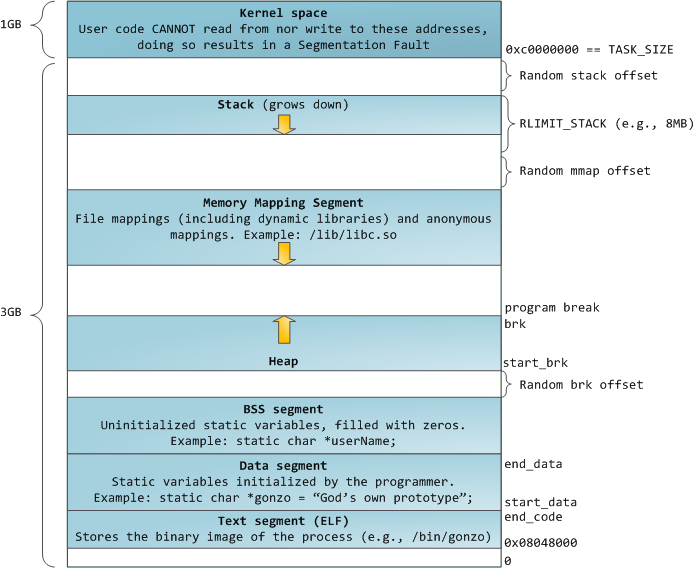
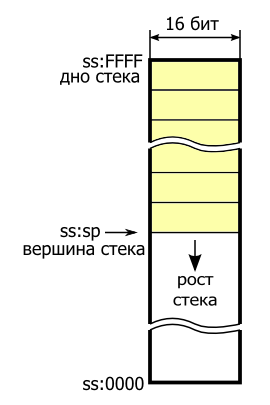
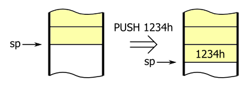
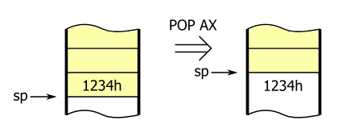
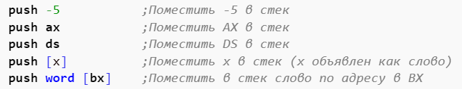

# Урок 1 - Введение в эксплуатацию бинарных уязвимостей

[TOC]

### Введение

Данный курс посвящен изучению эксплуатации бинарных уязвимостей на примере исполняемых файлов ОС Linux. Для отладки программ будет использоваться в основном отладчик GDB, сплоиты предполагается писать на языке python с использованием библиотеки pwn. В ходе курса будут рассмотрены базовые техники эксплуатации и способы защиты от них. На практике будут использоваться простые, небольшие по размеру консольные программы.

В данном уроке будут рассмотрены базовые понятия, необходимые для дальнейшего изучения.

### Основная часть

#### Язык ассемблер

**Язык ассемблера** — символьная форма записи машинного кода, использование которого упрощает написание машинных программ. Команды языка ассемблера один к одному соответствуют командам процессора. Каждая модель (или семейство) процессоров имеет свой набор — систему — команд и соответствующий ему язык ассемблера. Наиболее популярные синтаксисы — **Intel** и **AT&T**. Эти синтаксисы представляют одни и те же команды по-разному:

```assembly
mov eax, ebx (Intel)
movl %ebx, %eax (AT&T)
```

В рамках курса будем использовать синтаксис Intel.

Общий формат записи инструкций одинаков для обоих стандартов:

`[метка:] опкод [операнды] [;комментарий]`

**Опкод** — это и есть собственно ассемблерная команда, мнемоника инструкции процессору. В качестве операндов могут выступать константы, названия регистров, адреса в оперативной памяти и так далее. Различия между стандартами Intel и AT&T касаются в основном порядка перечисления операндов и их синтаксиса при разных методах адресации.

В среде ОС UNIX более популярен синтаксис типа AT&T, однако учебных пособий по нему нет, он описывается исключительно в справочной и технической литературе. Поэтому логично выбрать ассемблер на основе синтаксиса Intel. Для UNIX-систем есть два основных ассемблера — это NASM (Netwide Assembler) и FASM (Flat Assembler). Для линейки Windows популярностью пользуются FASM и MASM (Macro Assembler) от фирмы Microsoft, и также существовал еще TASM (Turbo Assembler). Будем использовать **NASM** в виду его кроссплатформенности.

[список основных команд](https://github.com/bin-exp.github.io/docs/Основные команды ASM/Основные команды ASM.md)

#### Организация памяти программы 

Каждый процесс в многозадачной ОС работает в своей «песочнице» в памяти. Это виртуальное адресное пространство, которое в 32-битном режиме представляет собою 4Гб блок адресов. Эти виртуальные адреса ставятся в соответствие (mapping) физической памяти таблицами страниц, которые поддерживает ядро ОС. У каждого процесса есть свой набор таблиц. Но если мы начинаем использовать виртуальную адресацию, приходится использовать её для всех программ, работающих на компьютере – включая и само ядро. Поэтому часть пространства виртуальных адресов необходимо резервировать под ядро.

Таким образом виртуальное пространство программы состоит из:

- Kernel space
- Stack
- Mmap segment
- Heap
- BSS segment
- Data segment
- Text segment




##### Пространство ядра

Пространство памяти для ядра отмечено в таблицах страниц как эксклюзивно используемое привилегированным кодом, поэтому если какая-то программа пытается получить в него доступ, случается page fault. В Linux пространство памяти для ядра присутствует постоянно, и ставит в соответствие одну и ту же часть физической памяти у всех процессов. Код ядра и данные всегда имеют адреса, и готовы обрабатывать прерывания и системные вызовы в любой момент.

##### Стек

**Стек** - это область оперативной памяти для временного хранения данных, удобство
использования в отличие от сегментов данных заключается в том, что не надо
именовать отдельные ячейки для записи. Стек адресуется относительно сегментного
регистра SS. Ширина стека это размер элементов которые можно в него помещать. На
примере это 16 бит. Регистр SP Содержит адрес последнего добавленного элемента, он же
называется вершиной стека.



push/pop:







##### Сегмент отображения в память

Тут ядро размещает содержимое файлов напрямую в памяти. Любое приложение может запросить сделать это через системный вызов mmap() в Linux или CreateFileMapping() / MapViewOfFile() в Windows. Это удобный и быстрый способ организации операций ввода и вывода в файлы, поэтому он используется для подгрузки динамических библиотек. Также возможно создать анонимное место в памяти, не связанное с файлами, которое будет использоваться для данных программы.

##### Куча

Она обеспечивает выделение памяти во время выполнения программы, как и стек – но, в отличие от него, хранит те данные, которые должны пережить функцию, размещающую их. В большинстве языков есть инструменты для управления кучей. В этом случае удовлетворение запроса на размещение памяти выполняется совместно программой и ядром. В С интерфейсом для работы с кучей служит malloc().

##### Сегмент неинициализированных данных (BSS)

BSS и данные хранят статичные (глобальные) переменные в С. Разница в том, что BSS хранит содержимое непроинициализированных статичных переменных, чьи значения не были заданы программистом. 

Пример:

```c
int a;
char* str;

int main()
{}
```

```c
static char* username;
```

##### Сегмент инициализированных данных 

Сегмент данных, наоборот, содержит те переменные, которые были проинициализированы в коде. Эта часть памяти соответствует бинарному образу программы, содержащему начальные статические значения, заданные в коде.

Пример:

```c
char* hello = "Hello, world!";
int len = 256;
```

##### Сегмент текста


#### Регистры

**Регистры процессора** - внутренние ячейки процессора, которые служат для хранения информации с практически мгновенным доступом. В отличии от оперативной памяти, для чтения и записи в регистры не нужно обращаться к внешнему устройству через шину, потому что регистры встроены в процессор и являются одной из его основных частей.

Список регистров процессора (x86):

| Регистры общего назначения                                   | Сегментные регистры                        | Служебные регистры    |
| ------------------------------------------------------------ | ------------------------------------------ | --------------------- |
| EAX<br />EBX<br />ECX<br />EDX<br />ESP<br />EBP<br />ESI<br />EDI | CS<br />DS<br />SS<br />ES<br />FS<br />GS | EFLAGS<br />EIP<br /> |

Список регистров процессора (x64):

| Регистры общего назначения                                   | Служебные регистры |
| ------------------------------------------------------------ | ------------------ |
| RAX<br />RBX<br />RCX<br />RDX<br />RSP<br />RBP<br />RSI<br />RDI<br />R8 - R15 | RFLAGS<br />RIP    |

**Регистры общего назначения** - служат для хранения информации внутри процессора. Этот тип регистров отличает то, что они могут быть использованы в арифметических операциях и в них возможна запись значений с помощью команды MOV.

**Сегментные регистры** используются при формировании линейных адресов памяти. Вторым компонентом для формирования линейного адреса является смещение, называемое также эффективным адресом. Способ вычисления линейного адреса зависит от режима работы процессора.

[more](https://bin-exp.github.io/docs/Регистры процессора/регистры.md)

#### Флаги и условные переходы


#### 


#### Прерывания Linux


#### 


#### Простейшая программа - Hello World


#### Сетевой клиент и сервер


#### Как выглядят процессы в памяти Linux


#### права на память


#### процесс загрузки 


### Заключение


