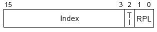
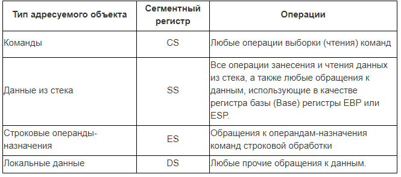

# Регистры процессора - список и описание

**Регистры процессора** - внутренние ячейки процессора, которые служат для хранения информации с практически мгновенным доступом. В отличии от оперативной памяти, для чтения и записи в регистры не нужно обращаться к внешнему устройству через шину, потому что регистры встроены в процессор и являются одной из его основных частей.

## Список регистров процессора по типам

| Регистры общего назначения                                   | Сегментные регистры                        | Служебные регистры                                  |
| ------------------------------------------------------------ | ------------------------------------------ | --------------------------------------------------- |
| EAX EBX ECX EDX ESP EBP ESI EDI | CS DS SS ES FS GS | EFLAGS EIP CR0 CR1 CR2 CR3 |

Список регистров процессора (x64):

| Регистры общего назначения                                   | Служебные регистры |
| ------------------------------------------------------------ | ------------------ |
| RAX RBX RCX RDX RSP RBP RSI RDI R8 - R15 | RFLAGS RIP    |

## Назначение регистров процессора

**Регистры процессора** предназначены для хранения информации, которая в любой момент должна быть доступна процессору. Это самая главная память компьютера. Если сравнить рабочий стол в мастерской с компьютером, то регистры процессора - это заготовки, материалы и чертежи, которые лежат на столе и постоянно используются. Среди всех внутренних регистров процессора можно выделить основные: регистры общего назначения. Это заготовки - данные, над которыми выполняются операции. Их сущность - это возможность быстрого доступа для выполнения операции.

**Регистры общего назначения** - служат для хранения информации внутри процессора. Этот тип регистров отличает то, что они могут быть использованы в арифметических операциях и в них возможна запись значений с помощью команды MOV.

**Сегментные регистры** используются при формировании линейных адресов памяти. Вторым компонентом для формирования линейного адреса является смещение, называемое также [эффективным адресом](https://osdev.fandom.com/ru/wiki/Эффективный_адрес). Способ вычисления [линейного адреса](https://osdev.fandom.com/ru/wiki/Линейный_адрес) зависит от режима работы процессора 

В [реальном режиме](https://osdev.fandom.com/ru/wiki/Реальный_режим) содержимое каждого сегментного регистра представляет собой номер параграфа — 16-байтового участка памяти, выровненного на границу 16 байт.

В [защищённом режиме](https://osdev.fandom.com/ru/wiki/Защищённый_режим) каждый сегментный регистр делится на три части, как показано на рисунке:

Бит *TI* в этом случае указывает, какая таблица дескрипторов должна использоваться: нуль соответствует [таблице глобальных дескрипторов (GDT)](https://osdev.fandom.com/ru/wiki/Таблица_глобальных_дескрипторов), единица — [таблице локальных дескрипторов (LDT)](https://osdev.fandom.com/ru/wiki/Таблица_локальных_дескрипторов). Поле *Index* является номером (индексом) дескриптора в таблице дескрипторов; этот дескриптор используется при вычислении [линейного адреса](https://osdev.fandom.com/ru/wiki/Линейный_адрес). Наконец, поле *RPL* является запрошенным уровнем привилегий, используемым для контроля прав доступа программы к сегменту (подробнее об этом говорится в разделе Защита на уровне сегментов). Частным случаем RPL является текущий уровень привилегий — CPL, чьё значение в любой момент времени находится в сегментном регистре CS.

 

***Логический адрес*** — это адрес, с которым обычно оперирует программное обеспечение, формируется он из двух величин. Первая — это 16-битный указатель сегмента(берется из соответствующего операции [сегментного регистра](http://www.club155.ru/x86internalreg-segment)), вторая — 32(16)-битное ***смещение*** относительно начала сегмента. Логический адрес существует лишь внутри процессора и имеет смысл для программного обеспечения. Его преобразование в [физический адрес](http://www.club155.ru/x86addr-lineaddress) для обращения к памяти осуществляется с помощью достаточно сложного механизма, функционирование которого существенно зависит от текущего режима работы процессора.

Программы могут использовать различные ***методы адресации*** (*методы формирования логического адреса*). В общем случае эти методы можно разделить на *прямые* и *косвенные*. Отличаются они способом задания 32(16)-битного смещения. Смещение может задаваться в коде программы непосредственным 32(16)-битным значением (***прямая адресация***), либо путем указания на регистр (регистры), значение в котором является смещением (***косвенная адресация***). 

 

## Краткое описание регистров

| Регистр EAX Универсальное хранилище. Обычно используется как буферная память для вычислений, передачи параметров и возврата результата выполнения подпрограммы (функции). Часто используется при системных вызовах операционных систем. | Регистр EBX Применяется для указания адреса памяти. Его еще называют регистром базы. Часто используется в командах доступа к оперативной памяти. Обычно используется в паре со смещением. |
| ------------------------------------------------------------ | :----------------------------------------------------------- |
| Регистр ECX Используется для счетчиков. Команды циклов процессора основаны именно на этом регистре. Эти команды автоматически меняют значение этого регистра. | Регистр EDX Применяется для передачи данных. Похож на регистр процессора EAX. Часто используется при системных вызовах операционных систем для передачи параметров. |
| Регистр ESP Указатель стека. Команды работы со стеком автоматически управляют значением этого регистра. | Регистр EBP Применяется для прямой адресации в стеке. Например, для доступа к локальным переменным. |
| Регистр ESI Используется в командах обработки набора байт. Перед использованием этих команд в регистр процессора ESI записывается адрес источника. | Регистр EDI Применяется в командах обработки набора байт. Перед использованием этих команд в регистр ESI записывается адрес назначения. |
| Регистр CS Указатель на сегмент кода. В защищенном режиме в этот регистр записывается селектор сегмента кода. | Регистр DS Указатель на сегмент данных. В защищенном режиме процессора в этот регистр записывается селектор сегмента данных. Именно этот регистр используется для расчета реального адреса в оперативной памяти по-умолчанию. |
| Регистр SS Указатель на сегмент стека. В защищенном режиме в этот регистр записывается селектор сегмента стека. | Регистр ESДополнительный сегментный регистр данных процессора. Часто используется для доступа к статическим данным программы, доступным только для чтения. |
| Регистр FS Дополнительный сегментный регистр данных. Впервые появился в процессоре Intel 80386. | Регистр GSДополнительный сегментный регистр данных. Впервые появился в процессоре Intel 80386. |
| Регистр флагов (EFLAGS) Битовые поля с флагами состояния. Отражает текущее состояние процессора. Большинство команд меняют биты этого регистра. | Регистр EIP Указатель на исполняемую инструкцию. Обычная запись значения в этот регистр невозможна. Он изменяется при каждом выполнении команды. Команды перехода записывают значение в этот регистр и процессор автоматически переходит на выполнение команд по нужному адресу. |
| Регистр CR0 Служит для чтения и изменения режима работы микропроцессора. С помощью этого регистра можно перевести процессора в защищенный режим, изменив только 1 бит. | Регистр CR1 Этот регистр зарезервирован и недоступен программисту. |
| Регистр CR2 В эту ячейку помещается адрес страницы, которая не найдена в памяти при страничной адресации. Служит для организации виртуальной памяти и файла подкачки. | Регистр CR3 Хранит в себе физический адрес каталога страниц при страничной адресации памяти процессора. С помощью этого регистра и каталога страниц процессор определяет какому логическому линейному адресу соответствует та или иная страница физической памяти компьютера. |

## Регистр флагов

Регистр флагов носит название **EFLAGS**. Это 32-разрядный регистр. Однако старшие 16 разрядов используются при работе в защищённом режиме, и пока мы их рассматривать не будем. К младшим 16 разрядам этого регистра можно обращаться как к отдельному регистру с именем FLAGS. Именно этот регистр мы и рассмотрим в этом разделе.

Каждый бит в регистре **FLAGS** является флагом. **Флаг** – это один или несколько битов памяти, которые могут принимать двоичные значения (или комбинации значений) и характеризуют состояние какого-либо объекта. Обычно флаг может принимать одно из двух логических значений. Поскольку в нашем случае речь идёт о бите, то каждый флаг в регистре может принимать либо значение 0, либо значение 1. Флаги устанавливаются в 1 при определённых условиях, или установка флага в 1 изменяет поведение процессора.

| Бит      | 15   | 14   | 13   | 12   | 11   | 10   | 9    | 8    | 7    | 6    | 5    | 4    | 3    | 2    | 1    | 0    |
| -------- | ---- | ---- | ---- | ---- | ---- | ---- | ---- | ---- | ---- | ---- | ---- | ---- | ---- | ---- | ---- | ---- |
| **Флаг** | 0    | NT   | IOPL | IOPL | OF   | DF   | IF   | TF   | SF   | ZF   | 0    | AF   | 0    | PF   | 1    | CF   |

|    Бит     | Обозначение |       Название        | Описание                                                     |
| :--------: | :---------: | :-------------------: | :----------------------------------------------------------- |
|     0      |     CF      |      Carry Flag       | **Флаг переноса.** Устанавливается в 1, если результат предыдущей операции не уместился в приемнике и произошел перенос из старшего бита или если требуется заем (при вычитании). Иначе установлен в 0. Например, этот флаг будет установлен при переполнении. |
|     1      |      1      |           -           | Зарезервирован                                               |
|     2      |     PF      |      Parity Flag      | **Флаг четности.** Устанавливается в 1, если младший байт результата предыдущей команды содержит четное количество битов, равных 1. Если количество единиц в младшем байте нечетное, то этот флаг равен 0. |
|     3      |      0      |           -           | Зарезервирован                                               |
|     4      |     AF      | Auxiliary Carry Flag  | **Вспомогательный флаг переноса.** Устанавливается в 1, если в результате предыдущей операции произошел перенос (или заем) из третьего бита в четвертый. |
|     5      |      0      |           -           | Зарезервирован                                               |
|     6      |     ZF      |       Zero Flag       | **Флаг нуля.** Устанавливается в 1, если результат предыдущей команды равен 0. |
|     7      |     SF      |       Sign Flag       | **Флаг знака.** Этот флаг всегда равен старшему биту результата. |
|     8      |     TF      |       Trap Flag       | **Флаг трассировки.** Он бил предусмотрен для работы отладчиков в пошаговом выполнении, которые не используют защищенный режим. Если этот флаг установить в 1, то после выполнения каждой программной команды управление временно передается отладчику. |
|     9      |     IF      | Interrupt Enable Flag | **Флаг разрешения прерываний.** Если сбросить этот флаг в 0, то процессор перестанет обрабатывать прерывания от внешних устройств. |
|     10     |     DF      |    Direction Flag     | **Флаг направления.** Контролирует поведение команд обработки строк. Если установлен в 1, то строки обрабатываются в сторону уменьшения адресов, если сброшен в 0, то наоборот. |
|     11     |     OF      |     Overflow Flag     | **Флаг переполнения.** Устанавливается в 1, если результат предыдущей арифметической операции над числами со знаком выходит за допустимые для них пределы. |
| 12 13 |    IOPL     |  I/O Privilege Level  | Уровень приоритета ввода/выводы.                             |
|     14     |     NT      |      Nested Task      | Флаг вложенности задач.                                      |
|     15     |      0      |           -           | Зарезервирован                                               |

